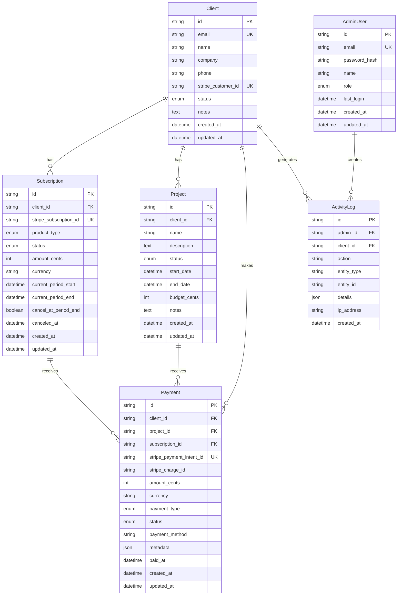

# Architecture Documentation

Complete architectural overview of the Myro Productions Portfolio website.

## Table of Contents

- [System Overview](#system-overview)
- [Architecture Patterns](#architecture-patterns)
- [Frontend Architecture](#frontend-architecture)
- [Backend Architecture](#backend-architecture)
- [Data Architecture](#data-architecture)
- [Infrastructure Architecture](#infrastructure-architecture)
- [Security Architecture](#security-architecture)
- [Performance Architecture](#performance-architecture)

## System Overview

The Myro Productions website is a full-stack web application built with Next.js 15, serving as both a portfolio showcase and client management system.

### High-Level Architecture

```
┌─────────────────────────────────────────────────────────────────────┐
│                          Internet Users                             │
└────────────────────────────┬────────────────────────────────────────┘
                             │
                             │ HTTPS
                             ▼
┌─────────────────────────────────────────────────────────────────────┐
│                       Cloudflare Edge Network                        │
│  ┌──────────────┐  ┌──────────────┐  ┌──────────────┐              │
│  │     CDN      │  │     WAF      │  │   SSL/TLS    │              │
│  └──────────────┘  └──────────────┘  └──────────────┘              │
└────────────────────────────┬────────────────────────────────────────┘
                             │
                             │ Cloudflare Tunnel (Encrypted)
                             ▼
┌─────────────────────────────────────────────────────────────────────┐
│                    Homelab (Mac Mini M4 - nicolasmac)               │
│                                                                      │
│  ┌─────────────────────────────────────────────────────────────┐   │
│  │                  Docker Network (app-network)                │   │
│  │                                                               │   │
│  │  ┌──────────────────────┐       ┌──────────────────────┐    │   │
│  │  │   cloudflared        │       │   Next.js App        │    │   │
│  │  │   (Tunnel Daemon)    │──────▶│   (Port 3000)        │    │   │
│  │  └──────────────────────┘       │   ┌──────────────┐   │    │   │
│  │                                  │   │ React 19 UI  │   │    │   │
│  │                                  │   ├──────────────┤   │    │   │
│  │                                  │   │  API Routes  │   │    │   │
│  │                                  │   ├──────────────┤   │    │   │
│  │                                  │   │ Middleware   │   │    │   │
│  │                                  │   └──────────────┘   │    │   │
│  │                                  └──────────┬───────────┘    │   │
│  │                                             │                │   │
│  │                                             │ Prisma Client  │   │
│  │                                             ▼                │   │
│  │                                  ┌──────────────────────┐    │   │
│  │                                  │   PostgreSQL 14      │    │   │
│  │                                  │   Database           │    │   │
│  │                                  └──────────────────────┘    │   │
│  │                                                               │   │
│  └───────────────────────────────────────────────────────────────┘   │
│                                                                      │
│  ┌───────────────────────────────────────────────────────────────┐  │
│  │              External Services (via HTTPS)                    │  │
│  │  ┌──────────────┐  ┌──────────────┐  ┌──────────────┐        │  │
│  │  │    Stripe    │  │   Vercel     │  │  Cloudflare  │        │  │
│  │  │   Payments   │  │  Analytics   │  │     API      │        │  │
│  │  └──────────────┘  └──────────────┘  └──────────────┘        │  │
│  └───────────────────────────────────────────────────────────────┘  │
└─────────────────────────────────────────────────────────────────────┘
```

### Technology Stack

#### Frontend
- **Framework**: Next.js 15.1.0 (App Router)
- **UI Library**: React 19.0.0
- **Language**: TypeScript 5.7.2
- **Styling**: Tailwind CSS 4.0.0
- **Animations**: GSAP 3.12.5 + ScrollTrigger
- **Motion**: Motion 11.15.0
- **Icons**: Lucide React 0.562.0

#### Backend
- **Runtime**: Node.js 20
- **API**: Next.js API Routes
- **ORM**: Prisma 6.2.0
- **Database**: PostgreSQL 14+
- **Authentication**: JWT (jose 6.1.3)
- **Password Hashing**: bcrypt 5.1.1
- **Validation**: Zod 4.3.4

#### Payments
- **Provider**: Stripe 18.3.0
- **Client**: @stripe/stripe-js 5.3.0
- **React Integration**: @stripe/react-stripe-js 3.2.0

#### Infrastructure
- **Containerization**: Docker (multi-stage)
- **Base Image**: Node.js 20 Alpine
- **Reverse Proxy**: Cloudflare Tunnel
- **DNS/CDN**: Cloudflare
- **Hosting**: Self-hosted (Docker on Mac Mini M4)

#### Development
- **Testing**: Jest 30.2.0 + Playwright 1.57.0
- **Linting**: ESLint 9.17.0
- **Version Control**: Git with worktrees

## Architecture Patterns

### 1. Server-First Architecture

The application follows a server-first approach leveraging React Server Components:

```
Request Flow:
1. User requests page
2. Server executes React Server Components
3. Server fetches data (no client-side loading)
4. Server renders HTML with data
5. Client receives fully rendered page
6. Client hydrates interactive components
```

**Benefits**:
- Faster initial page loads
- Better SEO
- Reduced client bundle size
- Secure server-side data access

### 2. API Route Pattern

```typescript
// app/api/[resource]/route.ts pattern
export async function GET(request: Request) {
  // 1. Authentication check
  // 2. Input validation
  // 3. Database query
  // 4. Response formatting
}
```

All API routes follow:
- RESTful conventions
- Proper HTTP status codes
- JSON response format
- Error handling middleware
- Authentication checks

### 3. Component Architecture

```
components/
├── ui/                    # Reusable UI components (buttons, inputs)
├── layout/                # Layout components (header, footer)
├── features/              # Feature-specific components
│   ├── admin/             # Admin dashboard components
│   ├── portfolio/         # Portfolio showcase components
│   └── payment/           # Payment flow components
└── shared/                # Shared utility components
```

**Component Principles**:
- Single Responsibility Principle
- Composition over inheritance
- Props typing with TypeScript
- Server Components by default, Client Components when needed

### 4. Data Flow Pattern

```
┌──────────────┐
│  User Action │
└──────┬───────┘
       │
       ▼
┌──────────────┐
│  API Route   │
└──────┬───────┘
       │
       ▼
┌──────────────┐
│    Prisma    │
└──────┬───────┘
       │
       ▼
┌──────────────┐
│  PostgreSQL  │
└──────────────┘
```

Unidirectional data flow:
1. User action triggers API call
2. API route validates and processes
3. Prisma executes type-safe database query
4. Response returned to client
5. UI updates with new data

## Frontend Architecture

### App Router Structure

```
app/
├── (public)/              # Public-facing pages
│   ├── page.tsx           # Homepage (/)
│   ├── about/
│   ├── services/
│   ├── portfolio/
│   └── contact/
│
├── admin/                 # Protected admin area
│   ├── layout.tsx         # Admin layout with navigation
│   ├── page.tsx           # Dashboard
│   ├── login/
│   ├── clients/
│   ├── projects/
│   ├── payments/
│   └── subscriptions/
│
├── api/                   # API routes
│   ├── contact/
│   ├── webhooks/
│   │   └── stripe/
│   └── admin/
│       ├── auth/
│       ├── clients/
│       ├── projects/
│       └── payments/
│
├── layout.tsx             # Root layout
├── globals.css            # Global styles
└── middleware.ts          # Auth middleware (route protection)
```

### Server vs Client Components

**Server Components** (default):
- All components render on server unless marked 'use client'
- Direct database access via Prisma
- No bundle size impact
- Used for: layouts, pages, data fetching

**Client Components**:
- Marked with 'use client' directive
- Required for: hooks, event handlers, browser APIs
- Used for: forms, animations, interactive elements

Example:
```typescript
// Server Component (default)
async function ServerPage() {
  const data = await prisma.client.findMany();
  return <ClientComponent data={data} />;
}

// Client Component
'use client';
function ClientComponent({ data }) {
  const [state, setState] = useState(data);
  return <button onClick={() => setState(...)}>Click</button>;
}
```

### Animation Architecture

GSAP animations follow this pattern:

```typescript
'use client';
import { useGSAP } from '@gsap/react';
import gsap from 'gsap';
import { ScrollTrigger } from 'gsap/ScrollTrigger';

gsap.registerPlugin(ScrollTrigger);

function AnimatedComponent() {
  const containerRef = useRef<HTMLDivElement>(null);

  useGSAP(() => {
    // Animation code
    gsap.from('.element', {
      opacity: 0,
      y: 50,
      scrollTrigger: {
        trigger: '.element',
        start: 'top 80%',
      }
    });
  }, { scope: containerRef }); // Automatic cleanup

  return <div ref={containerRef}>...</div>;
}
```

## Backend Architecture

### API Route Structure

```typescript
// app/api/admin/clients/route.ts
import { NextResponse } from 'next/server';
import { prisma } from '@/lib/db';
import { verifyAuth } from '@/lib/auth';

export async function GET(request: Request) {
  // 1. Authenticate
  const auth = await verifyAuth();
  if (!auth) {
    return NextResponse.json({ error: 'Unauthorized' }, { status: 401 });
  }

  // 2. Parse query parameters
  const { searchParams } = new URL(request.url);
  const status = searchParams.get('status');

  // 3. Database query
  const clients = await prisma.client.findMany({
    where: status ? { status } : undefined,
    include: {
      subscriptions: true,
      projects: true,
    },
    orderBy: { created_at: 'desc' },
  });

  // 4. Return response
  return NextResponse.json({ clients });
}

export async function POST(request: Request) {
  // Create new client
}
```

### Database Architecture

See [Data Architecture](#data-architecture) section for detailed database schema.

### Middleware Flow

```typescript
// middleware.ts
export async function middleware(request: NextRequest) {
  // 1. Check if route requires authentication
  if (request.nextUrl.pathname.startsWith('/admin')) {
    // 2. Skip login page
    if (request.nextUrl.pathname === '/admin/login') {
      return NextResponse.next();
    }

    // 3. Verify JWT from cookie
    const token = request.cookies.get('auth_token')?.value;
    if (!token) {
      return NextResponse.redirect(new URL('/admin/login', request.url));
    }

    try {
      // 4. Validate token
      const { payload } = await jwtVerify(token, secret);

      // 5. Add user context to headers
      const requestHeaders = new Headers(request.headers);
      requestHeaders.set('x-user-id', payload.sub as string);
      requestHeaders.set('x-user-role', payload.role as string);

      return NextResponse.next({ request: { headers: requestHeaders } });
    } catch (error) {
      // 6. Redirect on invalid token
      return NextResponse.redirect(new URL('/admin/login', request.url));
    }
  }

  return NextResponse.next();
}
```

## Data Architecture

### Database Schema



### Data Access Patterns

#### 1. Repository Pattern (via Prisma)

```typescript
// lib/repositories/clientRepository.ts
export class ClientRepository {
  async findAll(filters?: ClientFilters) {
    return prisma.client.findMany({
      where: filters,
      include: {
        subscriptions: true,
        projects: true,
      },
    });
  }

  async findById(id: string) {
    return prisma.client.findUnique({
      where: { id },
      include: {
        subscriptions: true,
        projects: true,
        payments: true,
      },
    });
  }

  async create(data: CreateClientDto) {
    return prisma.client.create({ data });
  }

  async update(id: string, data: UpdateClientDto) {
    return prisma.client.update({
      where: { id },
      data,
    });
  }
}
```

#### 2. Transaction Pattern

```typescript
// For operations requiring atomicity
await prisma.$transaction(async (tx) => {
  // 1. Create client
  const client = await tx.client.create({
    data: clientData,
  });

  // 2. Create Stripe customer
  const stripeCustomer = await stripe.customers.create({
    email: client.email,
  });

  // 3. Update client with Stripe ID
  await tx.client.update({
    where: { id: client.id },
    data: { stripe_customer_id: stripeCustomer.id },
  });

  // 4. Log activity
  await tx.activityLog.create({
    data: {
      admin_id: adminId,
      action: 'CREATE_CLIENT',
      entity_type: 'CLIENT',
      entity_id: client.id,
    },
  });

  return client;
});
```

### Caching Strategy

No aggressive caching currently implemented (focus on correctness over speed for admin dashboard).

Future considerations:
- Redis for session caching
- Query result caching for expensive operations
- Cloudflare CDN caching for static assets

## Infrastructure Architecture

### Docker Architecture

Multi-stage build for optimized image size:

```dockerfile
# Stage 1: Dependencies
FROM node:20-alpine AS deps
COPY package*.json ./
RUN npm ci

# Stage 2: Builder
FROM node:20-alpine AS builder
COPY --from=deps /app/node_modules ./node_modules
COPY . .
RUN npx prisma generate
RUN npm run build

# Stage 3: Runner (production)
FROM node:20-alpine AS runner
COPY --from=builder /app/.next/standalone ./
COPY --from=builder /app/.next/static ./.next/static
COPY --from=builder /app/public ./public
USER nextjs
CMD ["node", "server.js"]
```

Result: ~140MB production image (vs 1.2GB without optimization)

### Network Architecture

```
Internet
    │
    ▼
Cloudflare Edge (Global)
    │
    ├─ DDoS Protection
    ├─ WAF Rules
    ├─ SSL Termination
    ├─ CDN Caching
    └─ Bot Protection
    │
    ▼
Cloudflare Tunnel (Encrypted WireGuard/QUIC)
    │
    ▼
Home Network (10.0.0.0/24)
    │
    ├─ Mac Mini M4 (10.0.0.223) - Docker Host
    │   ├─ cloudflared container
    │   ├─ myro-website container (port 3000)
    │   └─ postgres container (port 5432)
    │
    ├─ Mac Mini M4 Pro (10.0.0.210) - Development
    ├─ Windows PC (10.0.0.10) - GPU workloads
    ├─ Pi 5 (10.0.0.172) - ESPHome
    └─ Pi 3 (10.0.0.100) - Pi-hole DNS
```

### Deployment Flow

```
1. Development
   ├─ Code changes on Mac Mini M4 Pro (10.0.0.210)
   ├─ Git commit to Gitea (10.0.0.223:3000)
   └─ Optionally push to GitHub

2. Build
   ├─ SSH to Docker host (nicolasmac at 10.0.0.223)
   ├─ Pull latest code from Gitea
   ├─ Build Docker image with environment variables
   └─ Tag image with version

3. Deploy
   ├─ Stop old container
   ├─ Start new container with updated image
   ├─ Health check validation
   └─ Monitor logs

4. Rollback (if needed)
   ├─ Stop failed container
   ├─ Start previous version container
   └─ Investigate issues
```

## Security Architecture

### Authentication Flow

```
┌────────────┐         ┌────────────┐         ┌────────────┐
│   Browser  │         │  Next.js   │         │  Database  │
└─────┬──────┘         └─────┬──────┘         └─────┬──────┘
      │                      │                       │
      │  POST /api/login     │                       │
      │  {email, password}   │                       │
      ├─────────────────────▶│                       │
      │                      │  Query admin user     │
      │                      ├──────────────────────▶│
      │                      │                       │
      │                      │  Return user+hash     │
      │                      │◀──────────────────────┤
      │                      │                       │
      │                      │  Verify password      │
      │                      │  (bcrypt.compare)     │
      │                      │                       │
      │                      │  Generate JWT         │
      │                      │  (sign with secret)   │
      │                      │                       │
      │  Set-Cookie:         │                       │
      │  auth_token=JWT      │                       │
      │  (httpOnly, Secure)  │                       │
      │◀─────────────────────┤                       │
      │                      │                       │
      │  Subsequent requests │                       │
      │  Cookie: auth_token  │                       │
      ├─────────────────────▶│                       │
      │                      │  Verify JWT           │
      │                      │  (check signature)    │
      │                      │                       │
      │  Protected data      │                       │
      │◀─────────────────────┤                       │
```

### Security Layers

1. **Network Layer**
   - Cloudflare DDoS protection
   - WAF rules for common attacks
   - Rate limiting (100 req/min per IP)
   - No exposed ports on home network

2. **Application Layer**
   - JWT authentication with httpOnly cookies
   - CSRF protection (SameSite cookies)
   - XSS protection (Content Security Policy)
   - Input validation with Zod schemas
   - SQL injection prevention (Prisma parameterized queries)

3. **Data Layer**
   - Encrypted database connections
   - Password hashing with bcrypt (10 rounds)
   - Sensitive data never logged
   - Database user with minimal permissions

4. **Container Layer**
   - Non-root user (nextjs:1001)
   - Minimal Alpine Linux base image
   - No unnecessary packages
   - Regular security updates

### Threat Model

**Protected Against**:
- SQL Injection (Prisma parameterized queries)
- XSS (httpOnly cookies, CSP headers)
- CSRF (SameSite=Lax cookies)
- Brute Force (rate limiting, account lockout)
- DDoS (Cloudflare protection)
- Man-in-the-Middle (TLS 1.3, HTTPS everywhere)

**Potential Risks**:
- JWT secret exposure (mitigated: environment variable, not in code)
- Cloudflare dependency (mitigated: can failover to VPN/VPS)
- Docker escape (mitigated: non-root user, minimal image)

## Performance Architecture

### Frontend Performance

**Metrics Targets**:
- First Contentful Paint (FCP): < 1.5s
- Largest Contentful Paint (LCP): < 2.5s
- Total Blocking Time (TBT): < 200ms
- Cumulative Layout Shift (CLS): < 0.1
- Time to Interactive (TTI): < 3.5s

**Optimizations**:
1. Server-side rendering for instant content
2. Code splitting with Next.js automatic chunking
3. Image optimization with next/image
4. Font optimization with next/font
5. CSS minification and tree-shaking (Tailwind)
6. Gzip/Brotli compression via Cloudflare
7. CDN caching for static assets

### Backend Performance

**Database**:
- Indexed foreign keys
- Indexed frequently queried fields
- Connection pooling (10-20 connections)
- Query optimization with Prisma

**API Routes**:
- Efficient database queries (select only needed fields)
- Pagination for large result sets
- Streaming responses for large data

### Monitoring

Current monitoring:
- Vercel Analytics for frontend metrics
- Cloudflare Analytics for traffic patterns
- Docker logs for application logs
- PostgreSQL logs for database issues

Future: Add APM tool (DataDog, New Relic) for deeper insights.

---

For more architectural decisions and their rationale, see [ADR Directory](./adr/README.md).
